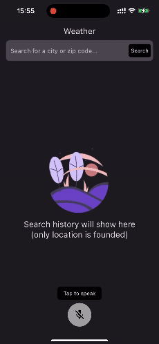
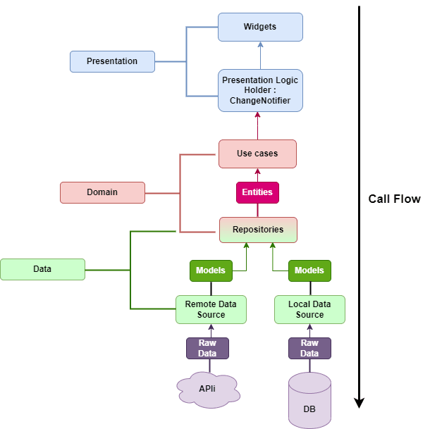

# Weather Flutter App

Don't repeat your-self. In my search for coding challenges, I stumbled upon a weather app with a pretty good code base. Instead of starting from scratch, I saw an opportunity to enhance it so I decided to develop new features on-top of this challenge.



This repository contains all source code flutter for the project.

- Language: Dart
- Flutter: stable 3.13.7
- IDE:  Visual Code / Android Studio
- Device Orientation: Portrail (primary)
- Standard design: iPhone SE 
- flavor: not set up

# Architecture

Apply Clean Architecture + MVVM (with BloC used to replace the traditional ViewModel).

```
|-----------------  Layers  ------------------|
| Presentations  |  Doamin     |   Data Layer |
|:-------------------------------------------:|

|--------------------------  Actual  ---------------------------|
| Presentations  |        Doamin          |         Data        |
|:-------------------------------------------------------------:|
|  UI <--> ViewModel <--> UseCase <--> Repository <--> API/Local|
|:-------------------------------------------------------------:|
|:----       Entity         ----|----       Model      --------:|
|:-------------------------------------------------------------:|
```


# Features
- [x] Location Input: Users should be able to input a location (e.g., city name or zip code).
- [x] Weather Display: Upon entering a location, the app should fetch and display the current weather information 
- [x] Error Handling: Implement basic error handling for cases where the location input is invalid or the weather data cannot be retrieved.
- [x] Search for cities, zipcode by voice
